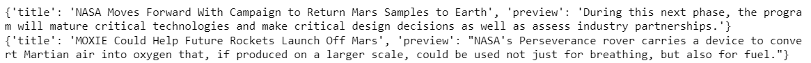

# Unit 12 Homework: web-scraping-challenge (Mission to Mars)

# Objective
Now we are ready to take on the full web-scraping and data analysis project for the mission to Mars.
As we work on this Challenge, we will be strengthening the same core skills that we’ve been developing until now: collecting data, organizing and storing data, analyzing data, and then visually communicating our insights.
 
# Methodology
For this assignment, we are going to identify HTML elements on a page, identify their id and class attributes, and use this knowledge to extract information via both automated browsing with Splinter and HTML parsing with Beautiful Soup. We will scrape various types of information. These include HTML tables and recurring elements, like multiple news articles on a webpage. This assignment consists of two technical products:
* Deliverable 1: Scrape titles and preview text from Mars news articles. Optionally export the data into a JSON file or a MongoDB database.
* Deliverable 2: Scrape and analyze Mars weather data, which exists in a table.

## Deliverable 1: Scraped Titles and Preview Text from Mars News website.
* Used automated browsing to visit the Mars NASA news site Links to an external site. Inspected the page to identify which elements to scrape.Note that the URL is https://redplanetscience.com/.
* Created a Beautiful Soup object and used it to extract text elements from the website.
* Extracted the titles and preview text of the scraped news articles. Stored the scraping results in Python data structures as follows:
    * Stored each title-and-preview pair in a Python dictionary. And, gave each dictionary two keys: title and preview.
    * 
    * Stored all the dictionaries in a Python list.
    * Printed the list in notebook.
    * 
* Stored the scraped data in a file or database (to ease sharing the data with others): exported the scraped data to  a JSON file.

## Deliverable 2: Scraped and Analyzed Mars Weather Data
* Used automated browsing to visit the Mars Temperature Data Site Links to an external site. Inspected the page to identify which elements to scrape. Note that the URL is https://data-class-mars-challenge.s3.amazonaws.com/Mars/index.html.
* Created a Beautiful Soup object and used it to scrape the data in the HTML table. 
* Assembled the scraped data into a Pandas DataFrame. The columns have the same headings as the table on the website:
    *     
* Examined the data types associated with each column:
    * 
* Converted the data to the appropriate datetime, int, or float data types:
    * 
* Analyzed the dataset by using Pandas functions to answer the following questions:
    * How many months exist on Mars? 
        * Answer: 12
    * How many Martian (and not Earth) days worth of data exist in the scraped dataset?
        * Answer: 1867
    * What are the coldest and the warmest months on Mars (at the location of Curiosity)?    
        * 
    * What are the coldest and the warmest months on Mars (at the location of Curiosity)? 
        * Answer: On average, the third month has the coldest minimum temperature on Mars (-83.307292), and the eighth month is the warmest (-68.382979).  
    * Which months have the lowest and the highest atmospheric pressure on Mars?  
        * 
        * Answer: Atmospheric pressure is, on average, lowest in the sixth month (745.054422) and highest in the ninth (913.30597).
    * About how many terrestrial (Earth) days exist in a Martian year? 
    *   
        * Answer:The distance from peak to peak is roughly 1425-750, or 675 days. A year on Mars appears to be about 675 days from the plot. Internet search confirms that a Mars year is equivalent to 687 earth days.
* Exported the DataFrame to a CSV file.
    